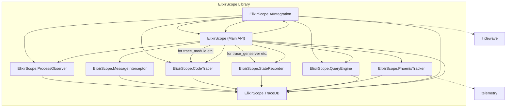

Okay, let's break down ElixirScope and devise a test-driven strategy to get it working robustly.

## 1. Analysis and Dependency Graph

First, I'll analyze the provided source code files to understand their relationships.

**Source Files Considered:**

*   `lib/elixir_scope.ex` (Main API)
*   `lib/elixir_scope/trace_db.ex` (Trace Data Storage)
*   `lib/elixir_scope/process_observer.ex` (Process & Supervision Monitor)
*   `lib/elixir_scope/message_interceptor.ex` (Message Tracer)
*   `lib/elixir_scope/code_tracer.ex` (Function Call Tracer)
*   `lib/elixir_scope/state_recorder.ex` (GenServer State Tracer)
*   `lib/elixir_scope/phoenix_tracker.ex` (Phoenix Application Tracer)
*   `lib/elixir_scope/query_engine.ex` (Data Querying & Analysis)
*   `lib/elixir_scope/ai_integration.ex` (AI Integration Layer)

**External Dependencies (not part of core ElixirScope inter-module dependencies for this graph):**

*   `telemetry` (used by `PhoenixTracker`)
*   `Tidewave` (used by `AIIntegration`)
*   `Phoenix`, `Phoenix.LiveView` (optional, related to `PhoenixTracker`)
*   Erlang's `:dbg`, `:sys`, `:ets`, `:erlang.system_monitor`

**Dependency Graph Generation:**

Let's list direct dependencies within the `ElixirScope` namespace:

1.  **`ElixirScope.TraceDB`**:
    *   Dependencies: None within `ElixirScope` namespace for its core functionality. Uses `:ets`, `GenServer`, `File`. (FOUNDATIONAL)

2.  **`ElixirScope.ProcessObserver`**:
    *   Depends on: `ElixirScope.TraceDB` (to store process events)

3.  **`ElixirScope.MessageInterceptor`**:
    *   Depends on: `ElixirScope.TraceDB` (to store message events)

4.  **`ElixirScope.CodeTracer`**:
    *   Depends on: `ElixirScope.TraceDB` (to store function call events)

5.  **`ElixirScope.StateRecorder`**:
    *   Depends on: `ElixirScope.TraceDB` (to store state and GenServer events, both via macro and `:sys.trace` handler)

6.  **`ElixirScope.PhoenixTracker`**:
    *   Depends on: `ElixirScope.TraceDB` (to store Phoenix-specific events)

7.  **`ElixirScope.QueryEngine`**:
    *   Depends on: `ElixirScope.TraceDB` (to query events and states)

8.  **`ElixirScope.AIIntegration`**:
    *   Depends on: `ElixirScope.TraceDB`, `ElixirScope.QueryEngine`, `ElixirScope.CodeTracer`, `ElixirScope` (main module for `trace_genserver`, `trace_module`), `ElixirScope.ProcessObserver` (for `get_supervision_tree`).
    *   Externally: `Tidewave`

9.  **`ElixirScope` (Main API)**:
    *   Depends on: `ElixirScope.TraceDB`, `ElixirScope.ProcessObserver`, `ElixirScope.MessageInterceptor`, `ElixirScope.CodeTracer`, `ElixirScope.PhoenixTracker`, `ElixirScope.AIIntegration`, `ElixirScope.StateRecorder`, `ElixirScope.QueryEngine`. (Orchestrator)

**Visualizing the Dependency Graph (Simplified):**

**Isolating Foundational Code Files:**

From the graph, **`ElixirScope.TraceDB`** is the most foundational internal component. All tracers write to it, and the `QueryEngine` reads from it. It does not depend on any other `ElixirScope` module for its core storage and retrieval logic.

Therefore, the test strategy should begin by thoroughly testing `ElixirScope.TraceDB`.

## 2. Layered Test-Driven Strategy

This strategy will build up from the foundational layer, ensuring each component is reliable before testing components that depend on it. We will use `ExUnit`.

### Layer 0: Foundational - `ElixirScope.TraceDB`

**Goal:** Ensure reliable and performant storage, indexing, and retrieval of trace events and states, including sampling and cleanup.

**Test Plan (`test/elixir_scope/trace_db_test.exs`):**

1.  **`start_link/1` and `init/1`:**
    *   Test that `TraceDB` starts successfully with default options.
    *   Test that ETS tables (`:elixir_scope_events`, `:elixir_scope_states`, `:elixir_scope_process_index`) are created and are of the correct type (`:ordered_set` or `:bag`).
    *   Test initialization with options: `:max_events`, `:persist` (and `:persist_path`), `:sample_rate`. Verify state.
    *   Test that periodic cleanup and persistence are scheduled if configured (mock `Process.send_after/3` or check for messages if possible, or test side effects later).

2.  **`store_event/2` (and `log_state/3` which uses it):**
    *   **Basic Storage:**
        *   Store various event types (`:process`, `:message`, `:function`, `:genserver_init`, custom types).
        *   Store `:state` events.
        *   Verify events are inserted into the correct ETS table (`@events_table` or `@states_table`).
        *   Verify events receive a unique, monotonic `:id` and a `:timestamp` if not provided.
        *   Verify the `event_count` in the `TraceDB` state is incremented.
    *   **Process Indexing:**
        *   Verify events with `:pid` are indexed in `@process_index`.
        *   Verify `:message` events correctly index `:from_pid` and `:to_pid` in `@process_index`.
    *   **Sampling (`should_record_event?/3` through `store_event`):**
        *   Test with `sample_rate: 1.0` (all non-critical events recorded).
        *   Test with `sample_rate: 0.0` (only critical events recorded).
        *   Test with `0.0 < sample_rate < 1.0` (a fraction of non-critical events recorded). Provide known PIDs/timestamps to test deterministic sampling if possible, or test statistically.
        *   Verify critical events (process spawn/exit, crash, error) always bypass sampling.
    *   **Data Integrity:** Store complex terms and verify they are stored and retrievable correctly.

3.  **Querying (`query_events/1`):**
    *   Seed `TraceDB` with a known set of diverse events.
    *   Test with no filters (returns all events sorted by timestamp).
    *   Test filtering by `:type` (e.g., `:state`, `:message`).
    *   Test filtering by `:pid`.
    *   Test filtering by `:from_pid`, `:to_pid` (for message events).
    *   Test filtering by `:timestamp_start` and `:timestamp_end`.
    *   Test combinations of filters.
    *   Test with filters that yield no results.

4.  **Specific Retrieval Functions:**
    *   **`get_state_history/1`:** Test it returns all `:state` events for a given PID, sorted by timestamp.
    *   **`get_events_at/2`:** Test it returns events within the specified timestamp window.
    *   **`next_event_after/1` and `prev_event_before/1`:** Test they find the correct next/previous event.
    *   **`get_processes_at/1`:** Seed with spawn/exit events. Verify it correctly identifies PIDs active at a given timestamp.
    *   **`get_state_at/2`:** Seed with multiple state events for a PID. Verify it returns the most recent state at or before the given timestamp. Test `:not_found` cases.

5.  **Management Functions:**
    *   **`clear/0`:** Verify all ETS tables are emptied and `event_count` is reset.
    *   **Event Cleanup (`handle_info :cleanup, ...`):**
        *   Configure `max_events`. Store more than `max_events`.
        *   Trigger cleanup (e.g., `send(pid, :cleanup)` or wait).
        *   Verify oldest events are removed from tables and `process_index`.
        *   Verify `event_count` is updated.
    *   **Persistence (`handle_info :persist, ...`):** (Lower priority if in-memory is the focus for "getting it working")
        *   Configure `persist: true` and a `persist_path`.
        *   Trigger persistence.
        *   Verify a file is created in `persist_path` and contains serialized ETS data.

**TDD Approach for `TraceDB`:**
Start with `test "start_link successfully starts and creates ETS tables"`. Write the test, watch it fail, implement `start_link` and `init` to create tables. Then `test "stores a simple event"`, implement `store_event` basics. Continue for each piece of functionality.

---

### Layer 1: Tracers

**General Strategy:** For each tracer, `start_link` it (and its dependency, `TraceDB`). Perform actions that should trigger tracing. Query `TraceDB` to assert that the correct events were stored with the correct data.

1.  **`ElixirScope.ProcessObserver` (`test/.../process_observer_test.exs`):**
    *   The existing `process_observer_test.exs` is a good foundation for supervision tree logic. Ensure it writes appropriate events to `TraceDB` if that's the mechanism.
    *   Test `start_link/1` correctly sets up system monitoring and traps exits.
    *   Test that process spawn/exit events (e.g., from `:EXIT` messages or system monitor) are correctly recorded in `TraceDB`.
    *   Test that `system_monitor` events (e.g., `:busy_port`) are recorded.
    *   Test `get_supervision_tree/0` returns the cached/reconstructed tree. Test that `build_supervision_tree/0` populates `TraceDB` with supervision structure events or updates its internal cache correctly.

2.  **`ElixirScope.MessageInterceptor` (`test/.../message_interceptor_test.exs`):**
    *   Test `start_link/1` with different `tracing_level` options.
    *   Test `enable_tracing/0`, `disable_tracing/0`, `set_tracing_level/1` behavior (e.g., `:dbg.p/2` calls made/cleared).
    *   Spawn two dummy processes. Send a message between them.
        *   If tracing is enabled and `tracing_level` appropriate: Verify `:send` and `:receive` events are stored in `TraceDB` with correct PIDs, message (sanitized).
        *   If tracing disabled or `tracing_level` inappropriate: Verify no events are stored.
    *   Test message sanitization logic (`maybe_sanitize_message/2`) based on `tracing_level`.

3.  **`ElixirScope.CodeTracer` (`test/.../code_tracer_test.exs`):**
    *   Define a simple test module with a few functions.
    *   Test `start_link/1`.
    *   Call `CodeTracer.trace_module(TestModule)`.
    *   Call functions in `TestModule`.
        *   Verify `:function_call` and `:function_return` events are stored in `TraceDB` with correct module, function, args (sanitized), result (sanitized), PID.
    *   Test `CodeTracer.stop_trace_module(TestModule)` clears `:dbg.tpl`.
    *   Test `get_module_source_info/1` (internal) functionality if its output is directly used or crucial.

4.  **`ElixirScope.StateRecorder` (`test/.../state_recorder_test.exs`):**
    *   **Macro Instrumentation (`__using__`):**
        *   Define a test GenServer that `use ElixirScope.StateRecorder`.
        *   Start the test GenServer.
        *   Trigger its `init/1`, `handle_call/3`, `handle_cast/2`, `handle_info/2`, `terminate/2`.
        *   Verify that `:genserver` (for callback invocation) and `:state` (for state snapshots) events are stored in `TraceDB` with correct PID, module, callback name, args/message, and state (sanitized).
        *   Test with GenServers that don't define all callbacks (relying on `@before_compile` defaults).
    *   **External Tracing (`trace_genserver/1`):**
        *   Define and start a plain test GenServer (without the macro).
        *   Call `StateRecorder.trace_genserver(pid_of_test_genserver)`.
        *   Interact with the test GenServer.
        *   Verify that trace messages captured by the spawned `handle_trace_messages/1` loop are correctly translated into `:genserver` or `:state` events in `TraceDB` (e.g., `:receive`, `:call`, `:return_from`, `:state_change`, `:DOWN`).
        *   Verify initial state capture using `:sys.get_state/1`.

5.  **`ElixirScope.PhoenixTracker` (`test/.../phoenix_tracker_test.exs`):**
    *   This requires a test setup that can emit Phoenix telemetry events. Consider using `ExUnit.Callbacks` to attach/detach handlers or manually calling `PhoenixTracker.handle_*_event/4` functions.
    *   Test `setup_phoenix_tracing/1`.
    *   For each `handle_*_event/4` function (e.g., `handle_endpoint_event`):
        *   Craft sample `measurements` and `metadata` that mimic real telemetry events.
        *   Call the handler function.
        *   Verify the corresponding `:phoenix` event is stored in `TraceDB` with correctly extracted and sanitized data.
    *   Test `stop_phoenix_tracing/0` detaches handlers.

---

### Layer 2: `ElixirScope.QueryEngine`

**Goal:** Ensure high-level queries accurately process and aggregate data from `TraceDB`.

**Test Plan (`test/.../query_engine_test.exs`):**

*   **Strategy:** In `setup`, populate `TraceDB` with a diverse, known set of events (programmatically, not necessarily by running full tracers, to isolate `QueryEngine` logic).
*   For each public function in `QueryEngine`:
    *   Call the function with appropriate arguments.
    *   Assert that the returned data is correct based on the pre-seeded `TraceDB` data.
    *   Examples:
        *   `message_flow(pid1, pid2)`: Verify it returns only messages between `pid1` and `pid2`.
        *   `state_timeline(pid)`: Verify it returns all state changes for `pid`.
        *   `execution_path(pid)`: Verify it returns function call/return events for `pid`.
        *   `system_snapshot_at(timestamp)`: This is complex.
            *   Verify `active_processes` list is correct.
            *   Verify `process_states` contains correct states for active PIDs.
            *   Verify `pending_messages` logic (acknowledging its approximation).
            *   Verify `reconstruct_supervision_tree_at` logic (acknowledging its simplification).
        *   `state_evolution(pid, start_time, end_time)`: Verify it correctly combines state, message, and function events and computes diffs.
        *   `compare_states(state1, state2)`: Test with map and non-map states, check diff output.
*   Test edge cases: empty `TraceDB`, no matching events for queries.

---

### Layer 3: `ElixirScope.AIIntegration`

**Goal:** Ensure tools are correctly registered with Tidewave and that ElixirScope data is correctly processed and formatted for AI consumption.

**Test Plan (`test/.../ai_integration_test.exs`):**

*   **Strategy:** Mock `Tidewave.Plugin.register_tool/1`. Use Mox for this.
*   **`setup/0` and `register_tidewave_tools/0`:**
    *   Call `AIIntegration.setup()`.
    *   Assert that `Tidewave.Plugin.register_tool/1` was called for each expected tool with the correct name, description, module, function, and argument schema.
*   For each `tidewave_*(args)` function (e.g., `tidewave_get_state_timeline/1`):
    *   Set up `TraceDB` and `QueryEngine` (or mock `QueryEngine` calls) to return specific data.
    *   Call the `tidewave_...` function with mock arguments (e.g., PID strings).
    *   Verify PID string decoding works.
    *   Verify the function calls the correct `QueryEngine` or `ElixirScope` API.
    *   Verify the result is formatted correctly (e.g., data summarized, PIDs as strings).
    *   Test error handling (e.g., invalid PID string, module not found).

---

### Layer 4: `ElixirScope` (Main API Module)

**Goal:** Ensure orchestration of components and configuration options are handled correctly.

**Test Plan (`test/.../elixir_scope_test.exs`):**

*   **`setup/1`:**
    *   Test with default options: Verify `TraceDB`, `ProcessObserver`, `MessageInterceptor`, `CodeTracer` are started.
    *   Test with `phoenix: true`: Verify `PhoenixTracker.setup_phoenix_tracing/1` is called.
    *   Test with `ai_integration: true`: Verify `AIIntegration.setup/0` is called (mock `AIIntegration`).
    *   Test with `trace_all: true`: Verify `trace_all_processes/0` is called (which in turn calls `trace_genserver/1`).
    *   Test `tracing_level` and `sample_rate` options are correctly passed to `TraceDB` and `MessageInterceptor`.
    *   Test validation logic for `tracing_level` and `sample_rate` (e.g., raises `ArgumentError` for invalid values).
*   **`stop/0`:**
    *   Verify core GenServers are stopped.
    *   Verify `:dbg.stop_clear()` is called.
*   **Delegated Functions (`trace_module/1`, `state_timeline/1`, etc.):**
    *   Mock the underlying module (e.g., `CodeTracer`, `QueryEngine`).
    *   Call the `ElixirScope` API function.
    *   Verify the correct function on the underlying module was called with the correct arguments.

---

### Layer 5: Sample Applications (Integration & End-to-End Testing)

**Goal:** Verify ElixirScope works in realistic scenarios and that data flows correctly through the system.

**Test Plan (within each sample app's `test/` directory, or a separate integration test suite):**

*   **Plain Elixir Sample App:**
    *   Start the application, which initializes `ElixirScope`.
    *   Perform actions in the app (e.g., create workers, send jobs).
    *   Use `ElixirScope.QueryEngine` functions to query trace data.
    *   Assert that expected events (process spawns, GenServer state changes via `use ElixirScope.StateRecorder`, messages) are present and correct.
*   **Phoenix Sample App:**
    *   Start the Phoenix application.
    *   Make HTTP requests, interact with LiveViews/Channels (if applicable).
    *   Use `PhoenixSampleApp.ElixirScopeDemo` functions (which use `ElixirScope.QueryEngine`).
    *   Verify that Phoenix-specific events, counter state changes, etc., are correctly traced and queryable.
    *   The demo functions themselves act as a form of test. Augment with assertions.

### General Testing Considerations:

*   **Setup and Teardown:** Use `setup` blocks in ExUnit to start necessary processes (like `TraceDB`) and `on_exit` to clean them up.
*   **Asynchronous Operations:** Be mindful of asynchronous operations (e.g., messages to GenServers, `:dbg` tracing). Use `:timer.sleep/1` sparingly or, preferably, poll for expected state/events, or use explicit synchronization where possible.
*   **Mocks:** Use mocking (e.g., with `Mox`) judiciously, primarily for external dependencies (`Tidewave`) or to isolate units when testing higher layers without wanting the full side effects of lower layers.
*   **Clarity:** Write clear, descriptive test names.

This layered TDD strategy will help build confidence in each part of ElixirScope systematically, making it easier to debug issues as they arise and ultimately get the entire codebase working reliably.
