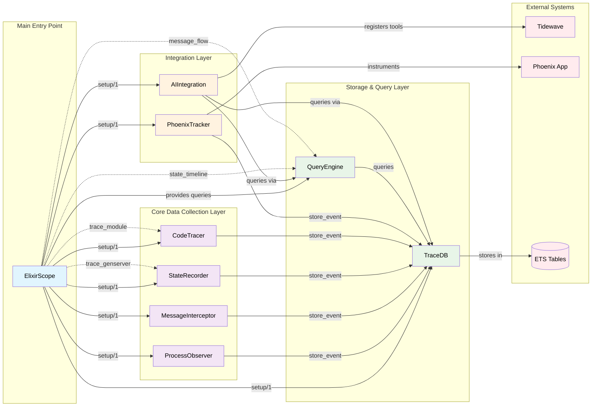
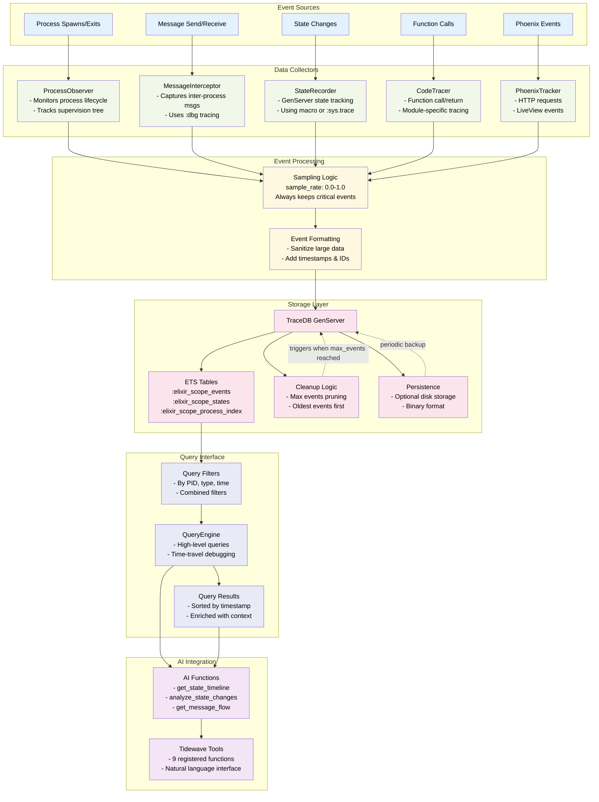
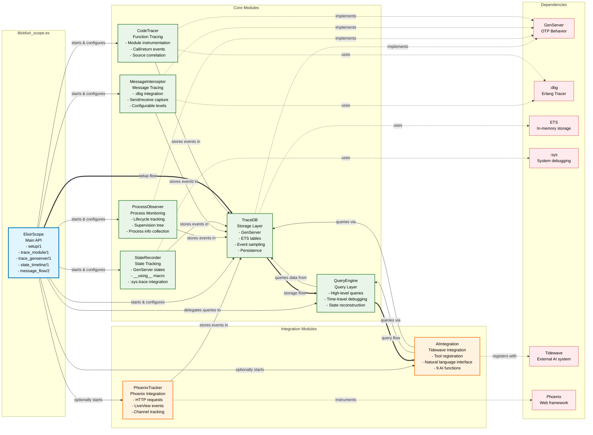
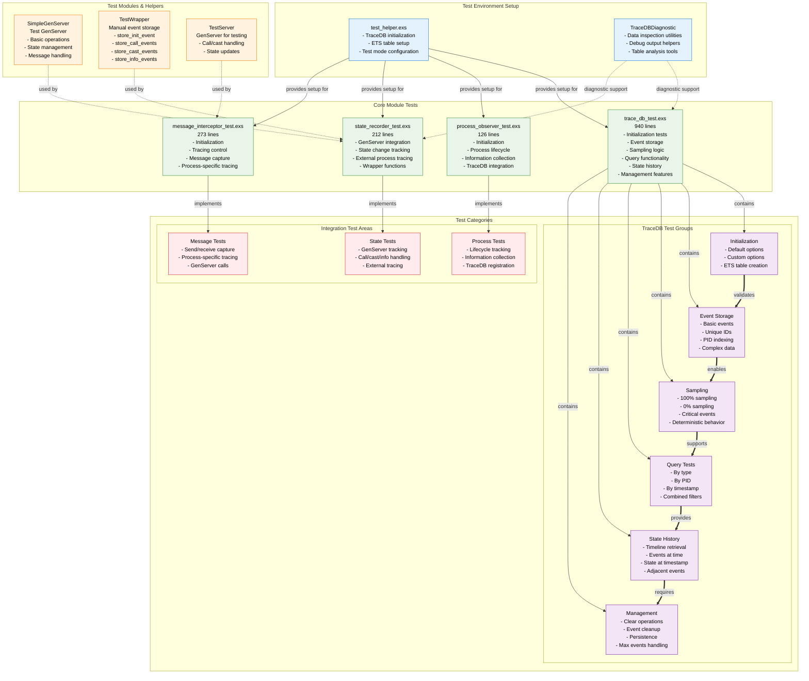
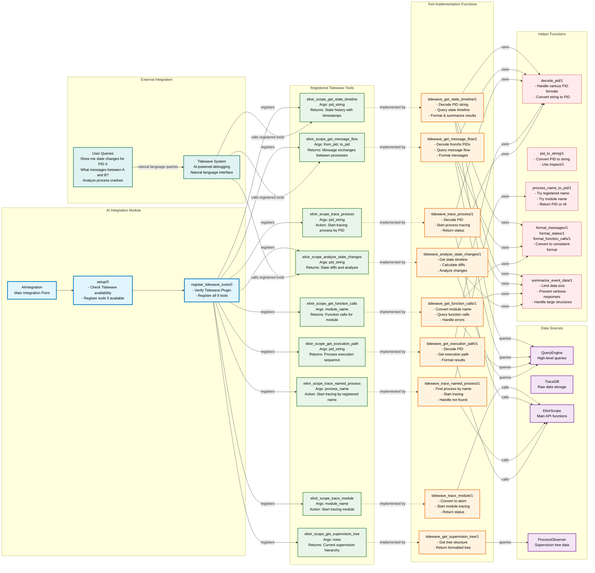
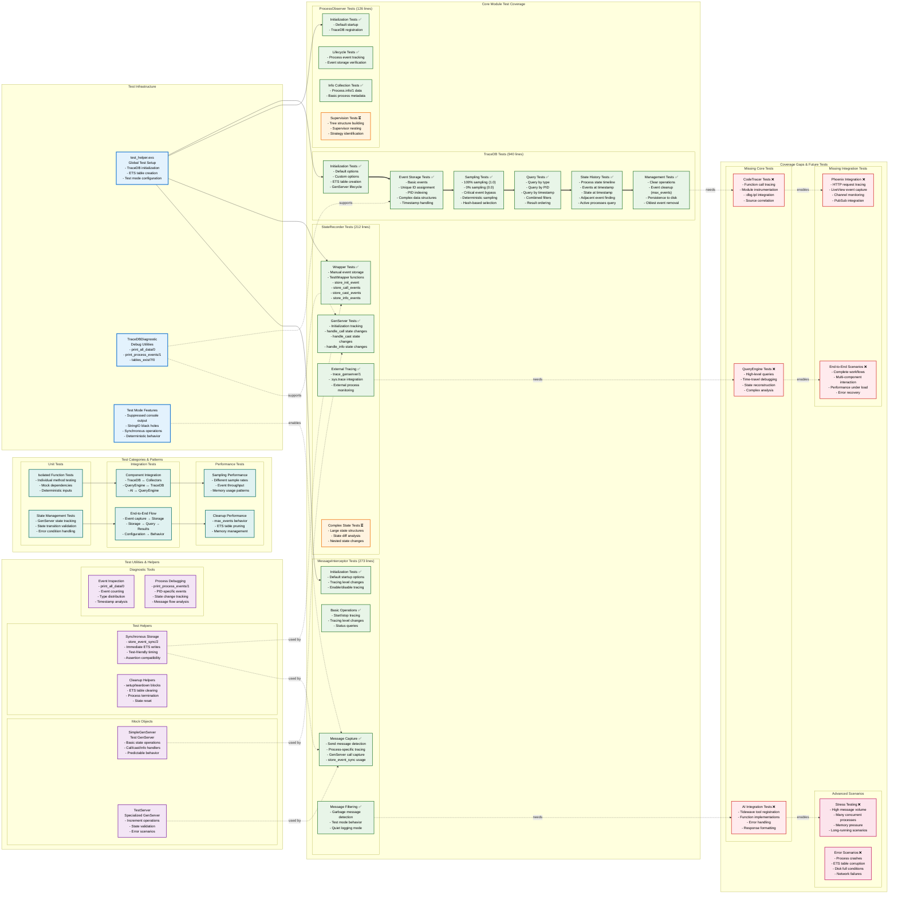

# ElixirScope Diagrams

## 1. **System Architecture** 
Shows the high-level component relationships, from the main entry point through data collection, storage, and integration layers. Highlights how ElixirScope coordinates between process observation, message interception, state recording, and external integrations.

## 2. **Data Flow & Event Processing**
Illustrates how events flow from various sources (process spawns, messages, state changes, function calls) through the data collectors, processing pipeline (sampling, formatting), storage layer, and finally to query interfaces and AI integration.

## 3. **Module Dependencies & Interactions**
Maps the specific dependencies between modules, showing both the logical flow (setup → storage → query) and implementation dependencies (GenServer, :dbg, ETS, etc.). This helps understand the layered architecture.

## 4 - Test Structure & Coverage

## 5. **AI Integration & Tidewave Tools**
Details the comprehensive AI integration, showing all 9 registered Tidewave tools, their implementation functions, helper utilities, and data source connections. This demonstrates the natural language debugging capabilities.

## 6. **Tracing Levels & Configuration Flow**
Shows how different tracing levels (:full, :messages_only, :states_only, :minimal, :off) affect component behavior, along with sampling configuration and performance implications.

```mermaid
graph LR
    subgraph "Configuration Entry Point"
        SETUP[ElixirScope.setup/1<br/>Configuration Options:<br/>- tracing_level<br/>- sample_rate<br/>- phoenix<br/>- ai_integration<br/>- trace_all]
    end
    
    subgraph "Tracing Level Options"
        direction LR
        FULL[":full<br/>Everything captured:<br/>- Function calls<br/>- Messages<br/>- State changes<br/>- Process lifecycle"]
        
        MSG_ONLY[":messages_only<br/>Messages only:<br/>- Send/receive events<br/>- Inter-process comm<br/>- No function calls<br/>- No state tracking"]
        
        STATE_ONLY[":states_only<br/>States only:<br/>- GenServer states<br/>- State transitions<br/>- No messages<br/>- No function calls"]
        
        MINIMAL[":minimal<br/>Oversight only:<br/>- Process spawn/exit<br/>- Major state changes<br/>- Critical events<br/>- Very low overhead"]
        
        OFF[":off<br/>Infrastructure only:<br/>- Sets up components<br/>- No active tracing<br/>- Can enable later<br/>- Zero overhead"]
    end
    
    subgraph "Sample Rate Configuration"
        SR_100[sample_rate: 1.0<br/>Record all events<br/>Maximum detail<br/>Higher overhead]
        
        SR_50[sample_rate: 0.5<br/>Record ~50% events<br/>Balanced approach<br/>Moderate overhead]
        
        SR_10[sample_rate: 0.1<br/>Record ~10% events<br/>Production safe<br/>Low overhead]
        
        SR_0[sample_rate: 0.0<br/>Critical events only<br/>Spawn/exit/crash<br/>Minimal overhead]
    end
    
    subgraph "Component Configuration Flow"
        direction TB
        
        subgraph "TraceDB Setup"
            TDB_INIT[TraceDB.start_link<br/>- storage: :ets<br/>- sample_rate config<br/>- max_events limit]
            TDB_SAMPLE[Sampling Logic<br/>- Critical events bypass<br/>- Deterministic sampling<br/>- Hash-based selection]
        end
        
        subgraph "ProcessObserver Setup"
            PO_INIT[ProcessObserver.start_link<br/>tracing_level: config]
            PO_ENABLE{Enable Process<br/>Tracking?}
            PO_TRACK[Track Process<br/>Lifecycle Events]
            PO_SKIP[Skip Process<br/>Tracking]
        end
        
        subgraph "MessageInterceptor Setup"
            MI_INIT[MessageInterceptor.start_link<br/>tracing_level: config]
            MI_ENABLE{Enable Message<br/>Tracing?}
            MI_DBG["Start :dbg Tracer<br/>p(:all, [:send, :receive])"]
            MI_SKIP[Skip Message<br/>Tracing]
        end
        
        subgraph "StateRecorder Setup"
            SR_INIT[StateRecorder Ready<br/>Available for tracing]
            SR_ENABLE{Enable State<br/>Tracking?}
            SR_MACRO[__using__ Macro<br/>Instrument GenServers]
            SR_SYS[:sys.trace Integration<br/>External GenServers]
            SR_SKIP[Skip State<br/>Recording]
        end
        
        subgraph "CodeTracer Setup"
            CT_INIT[CodeTracer.start_link<br/>tracing_level: config]
            CT_ENABLE{Enable Function<br/>Tracing?}
            CT_MODULE[Module-specific<br/>:dbg.tpl Setup]
            CT_SKIP[Skip Function<br/>Tracing]
        end
    end
    
    subgraph "Runtime Behavior"
        direction LR
        
        subgraph "Event Capture"
            CAPTURE[Event Captured]
            CRITICAL{Critical Event?<br/>spawn/exit/crash}
            SAMPLE{Passes Sampling?<br/>Based on sample_rate}
            LEVEL{Allowed by<br/>Tracing Level?}
            STORE[Store in TraceDB]
            DROP[Drop Event]
        end
        
        subgraph "Performance Impact"
            PERF_HIGH[High Performance Impact<br/>:full + sample_rate: 1.0<br/>Complete system visibility]
            
            PERF_MED[Medium Performance Impact<br/>:messages_only + sample_rate: 0.5<br/>Balanced monitoring]
            
            PERF_LOW[Low Performance Impact<br/>:minimal + sample_rate: 0.1<br/>Production safe]
            
            PERF_MIN[Minimal Performance Impact<br/>:off or sample_rate: 0.0<br/>Critical events only]
        end
    end
    
    %% Configuration flow
    SETUP --> FULL
    SETUP --> MSG_ONLY
    SETUP --> STATE_ONLY
    SETUP --> MINIMAL
    SETUP --> OFF
    
    SETUP --> SR_100
    SETUP --> SR_50
    SETUP --> SR_10
    SETUP --> SR_0
    
    %% Component initialization
    SETUP --> TDB_INIT
    SETUP --> PO_INIT
    SETUP --> MI_INIT
    SETUP --> SR_INIT
    SETUP --> CT_INIT
    
    TDB_INIT --> TDB_SAMPLE
    
    %% Conditional enablement based on tracing level
    PO_INIT --> PO_ENABLE
    PO_ENABLE -->|level != :off| PO_TRACK
    PO_ENABLE -->|level == :off| PO_SKIP
    
    MI_INIT --> MI_ENABLE
    MI_ENABLE -->|"level in [:full, :messages_only]"| MI_DBG
    MI_ENABLE -->|"level not in [:full, :messages_only]"| MI_SKIP
    
    SR_INIT --> SR_ENABLE
    SR_ENABLE -->|"level in [:full, :states_only]"| SR_MACRO
    SR_ENABLE -->|"level in [:full, :states_only]"| SR_SYS
    SR_ENABLE -->|"level not in [:full, :states_only]"| SR_SKIP
    
    CT_INIT --> CT_ENABLE
    CT_ENABLE -->|level == :full| CT_MODULE
    CT_ENABLE -->|level != :full| CT_SKIP
    
    %% Runtime event flow
    CAPTURE --> CRITICAL
    CRITICAL -->|Yes| STORE
    CRITICAL -->|No| SAMPLE
    SAMPLE -->|Yes| LEVEL
    SAMPLE -->|No| DROP
    LEVEL -->|Yes| STORE
    LEVEL -->|No| DROP
    
    %% Performance mapping
    FULL -.->|+ sample_rate: 1.0| PERF_HIGH
    MSG_ONLY -.->|+ sample_rate: 0.5| PERF_MED
    MINIMAL -.->|+ sample_rate: 0.1| PERF_LOW
    OFF -.->|or sample_rate: 0.0| PERF_MIN
    
    classDef config fill:#e3f2fd,stroke:#1976d2,stroke-width:3px,color:#000
    classDef level fill:#e8f5e8,stroke:#388e3c,stroke-width:2px,color:#000
    classDef sample fill:#fff3e0,stroke:#f57c00,stroke-width:2px,color:#000
    classDef component fill:#f3e5f5,stroke:#7b1fa2,stroke-width:2px,color:#000
    classDef runtime fill:#ffebee,stroke:#d32f2f,stroke-width:2px,color:#000
    classDef performance fill:#e0f2f1,stroke:#00695c,stroke-width:2px,color:#000
    classDef decision fill:#fce4ec,stroke:#c2185b,stroke-width:2px,color:#000
    
    class SETUP config
    class FULL,MSG_ONLY,STATE_ONLY,MINIMAL,OFF level
    class SR_100,SR_50,SR_10,SR_0 sample
    class TDB_INIT,PO_INIT,MI_INIT,SR_INIT,CT_INIT,TDB_SAMPLE,PO_TRACK,MI_DBG,SR_MACRO,SR_SYS,CT_MODULE component
    class CAPTURE,STORE,DROP runtime
    class PERF_HIGH,PERF_MED,PERF_LOW,PERF_MIN performance
    class PO_ENABLE,MI_ENABLE,SR_ENABLE,CT_ENABLE,CRITICAL,SAMPLE,LEVEL decision
```

## 7. **ETS Storage Structure & Data Organization**
Deep dive into the three ETS tables, their structure, data flow during storage and querying, event types, and management operations like cleanup and persistence.

```mermaid
graph LR
    subgraph "ETS Tables Structure"
        direction TB
        
        subgraph "Events Table (:elixir_scope_events)"
            ET[":elixir_scope_events<br/>Type: :ordered_set<br/>Key: event_id<br/>Stores: process, message, genserver, function events"]
            
            ET_STRUCT["Event Structure:<br/>{event_id, %{<br/>  id: unique_integer,<br/>  type: :process | :message | :genserver | :function,<br/>  pid: process_id,<br/>  timestamp: monotonic_time,<br/>  ...event_specific_data<br/>}}"]
        end
        
        subgraph "States Table (:elixir_scope_states)"
            ST[":elixir_scope_states<br/>Type: :ordered_set<br/>Key: state_id<br/>Stores: GenServer state snapshots"]
            
            ST_STRUCT["State Structure:<br/>{state_id, %{<br/>  id: unique_integer,<br/>  type: :state,<br/>  pid: process_id,<br/>  module: genserver_module,<br/>  state: serialized_state,<br/>  callback: :init | :handle_call | :handle_cast,<br/>  data: callback_context,<br/>  timestamp: monotonic_time<br/>}}"]
        end
        
        subgraph "Process Index (:elixir_scope_process_index)"
            PI[":elixir_scope_process_index<br/>Type: :bag<br/>Key: process_id<br/>Stores: {pid, {event_type, event_id}} mappings"]
            
            PI_STRUCT["Index Structure:<br/>{process_id, {event_type, event_id}}<br/>Where event_type can be:<br/>- :state<br/>- :process<br/>- :message<br/>- :message_sent<br/>- :message_received<br/>- :genserver<br/>- :function"]
        end
    end
    
    subgraph "Data Flow & Operations"
        direction LR
        
        subgraph "Store Event Flow"
            STORE_START["store_event(type, data)"]
            ADD_META[Add metadata:<br/>- unique ID<br/>- timestamp<br/>- type]
            ROUTE{Event Type?}
            STORE_EVENT[Store in events table]
            STORE_STATE[Store in states table]
            UPDATE_INDEX[Update process index]
        end
        
        subgraph "Query Flow"
            QUERY_START["query_events(filters)"]
            SELECT_TABLE{Query Type?}
            SCAN_EVENTS[Scan events table]
            SCAN_STATES[Scan states table]
            APPLY_FILTERS[Apply filters:<br/>- PID<br/>- timestamp range<br/>- event type]
            SORT_RESULTS[Sort by timestamp]
            RETURN_RESULTS[Return filtered results]
        end
        
        subgraph "Process-Specific Queries"
            PID_QUERY[Query by PID]
            LOOKUP_INDEX[Lookup in process index]
            GET_EVENT_IDS[Extract event IDs]
            FETCH_EVENTS[Fetch from events/states tables]
            MERGE_RESULTS[Merge and sort results]
        end
    end
    
    subgraph "Event Type Details"
        direction TB
        
        subgraph "Process Events"
            PROC_EVENT["Process Event<br/>type: :process<br/>Common fields:<br/>- pid<br/>- event: :spawn | :exit | :crash<br/>- info: process_info<br/>- timestamp"]
        end
        
        subgraph "Message Events"
            MSG_EVENT["Message Event<br/>type: :message<br/>Fields:<br/>- from_pid<br/>- to_pid (or just pid for receive)<br/>- message: sanitized_content<br/>- type: :send | :receive<br/>- timestamp"]
        end
        
        subgraph "State Events"
            STATE_EVENT[State Event<br/>type: :state<br/>Fields:<br/>- pid<br/>- module<br/>- state: sanitized_state<br/>- callback: triggering_callback<br/>- data: callback_context<br/>- timestamp]
        end
        
        subgraph "GenServer Events"
            GS_EVENT["GenServer Event<br/>type: :genserver<br/>Fields:<br/>- pid<br/>- module<br/>- callback: :init | :handle_*<br/>- message/args: sanitized<br/>- state_before: previous_state<br/>- timestamp"]
        end
        
        subgraph "Function Events"
            FUNC_EVENT["Function Event<br/>type: :function<br/>Fields:<br/>- pid<br/>- module<br/>- function<br/>- args: sanitized_args<br/>- type: :function_call | :function_return<br/>- result: return_value (for returns)<br/>- timestamp"]
        end
    end
    
    subgraph "Data Management"
        direction LR
        
        subgraph "Cleanup Operations"
            CLEANUP[Cleanup Process]
            CHECK_COUNT[Check event count vs max_events]
            FIND_OLDEST[Find oldest events by timestamp]
            DELETE_EVENTS[Delete from events table]
            DELETE_STATES[Delete from states table]
            UPDATE_INDEX_DEL[Remove from process index]
        end
        
        subgraph "Sampling Logic"
            SAMPLING[Sampling Decision]
            CRITICAL_CHECK{Critical Event?<br/>spawn/exit/crash/error}
            SAMPLE_RATE[Apply sample_rate]
            HASH_BASED[Hash-based selection<br/>using PID + timestamp]
            RECORD[Record Event]
            SKIP[Skip Event]
        end
        
        subgraph "Persistence"
            PERSIST[Persistence Process]
            EXPORT_DATA[Export ETS tables]
            BINARY_FORMAT[Convert to binary]
            WRITE_FILE[Write to disk]
            TIMESTAMP_NAME[Timestamp-based filename]
        end
    end
    
    %% Storage flow connections
    STORE_START --> ADD_META
    ADD_META --> ROUTE
    ROUTE -->|:state| STORE_STATE
    ROUTE -->|others| STORE_EVENT
    STORE_EVENT --> UPDATE_INDEX
    STORE_STATE --> UPDATE_INDEX
    
    %% Query flow connections
    QUERY_START --> SELECT_TABLE
    SELECT_TABLE -->|events| SCAN_EVENTS
    SELECT_TABLE -->|states| SCAN_STATES
    SELECT_TABLE -->|both| SCAN_EVENTS
    SELECT_TABLE -->|both| SCAN_STATES
    SCAN_EVENTS --> APPLY_FILTERS
    SCAN_STATES --> APPLY_FILTERS
    APPLY_FILTERS --> SORT_RESULTS
    SORT_RESULTS --> RETURN_RESULTS
    
    %% PID query connections
    PID_QUERY --> LOOKUP_INDEX
    LOOKUP_INDEX --> GET_EVENT_IDS
    GET_EVENT_IDS --> FETCH_EVENTS
    FETCH_EVENTS --> MERGE_RESULTS
    
    %% Table relationships
    ET -.->|indexed by| PI
    ST -.->|indexed by| PI
    
    %% Management connections
    CLEANUP --> CHECK_COUNT
    CHECK_COUNT --> FIND_OLDEST
    FIND_OLDEST --> DELETE_EVENTS
    FIND_OLDEST --> DELETE_STATES
    DELETE_EVENTS --> UPDATE_INDEX_DEL
    DELETE_STATES --> UPDATE_INDEX_DEL
    
    SAMPLING --> CRITICAL_CHECK
    CRITICAL_CHECK -->|Yes| RECORD
    CRITICAL_CHECK -->|No| SAMPLE_RATE
    SAMPLE_RATE --> HASH_BASED
    HASH_BASED --> RECORD
    HASH_BASED --> SKIP
    
    PERSIST --> EXPORT_DATA
    EXPORT_DATA --> BINARY_FORMAT
    BINARY_FORMAT --> WRITE_FILE
    WRITE_FILE --> TIMESTAMP_NAME
    
    classDef table fill:#e3f2fd,stroke:#1976d2,stroke-width:3px,color:#000
    classDef structure fill:#e8f5e8,stroke:#388e3c,stroke-width:2px,color:#000
    classDef flow fill:#fff3e0,stroke:#f57c00,stroke-width:2px,color:#000
    classDef event fill:#f3e5f5,stroke:#7b1fa2,stroke-width:2px,color:#000
    classDef management fill:#ffebee,stroke:#d32f2f,stroke-width:2px,color:#000
    classDef decision fill:#fce4ec,stroke:#c2185b,stroke-width:2px,color:#000
    
    class ET,ST,PI table
    class ET_STRUCT,ST_STRUCT,PI_STRUCT structure
    class STORE_START,ADD_META,STORE_EVENT,STORE_STATE,UPDATE_INDEX,QUERY_START,SCAN_EVENTS,SCAN_STATES,APPLY_FILTERS,SORT_RESULTS,RETURN_RESULTS,PID_QUERY,LOOKUP_INDEX,GET_EVENT_IDS,FETCH_EVENTS,MERGE_RESULTS flow
    class PROC_EVENT,MSG_EVENT,STATE_EVENT,GS_EVENT,FUNC_EVENT event
    class CLEANUP,CHECK_COUNT,FIND_OLDEST,DELETE_EVENTS,DELETE_STATES,UPDATE_INDEX_DEL,SAMPLING,HASH_BASED,RECORD,SKIP,PERSIST,EXPORT_DATA,BINARY_FORMAT,WRITE_FILE,TIMESTAMP_NAME management
    class ROUTE,SELECT_TABLE,CRITICAL_CHECK,SAMPLE_RATE decision
```

## 8. **QueryEngine Capabilities & Time-Travel Debugging**
Comprehensive view of the QueryEngine's API, from basic queries to advanced time-travel debugging features like system snapshots and state evolution analysis.

```mermaid
graph LR
    subgraph "QueryEngine API"
        QE[QueryEngine<br/>High-level Query Interface<br/>Built on TraceDB]
    end
    
    subgraph "Basic Query Functions"
        direction TB
        
        MF[message_flow/2<br/>Get messages between<br/>two processes<br/>Args: from_pid, to_pid]
        
        MF_FROM[messages_from/1<br/>All messages sent<br/>from a process<br/>Args: pid]
        
        MF_TO[messages_to/1<br/>All messages received<br/>by a process<br/>Args: pid]
        
        ST[state_timeline/1<br/>State changes for<br/>a process over time<br/>Args: pid]
        
        EP[execution_path/1<br/>Function calls and<br/>returns for process<br/>Args: pid]
        
        PE[process_events/1<br/>All events for<br/>a specific process<br/>Args: pid]
    end
    
    subgraph "Advanced Query Functions"
        direction TB
        
        SC_WIN[state_changes_in_window/2<br/>State changes in<br/>time window<br/>Args: start_time, end_time]
        
        MFC[module_function_calls/1<br/>Function calls for<br/>specific module<br/>Args: module]
        
        FC[function_calls/2<br/>Calls to specific<br/>function in module<br/>Args: module, function]
        
        GS_EVT[genserver_events/2<br/>GenServer operations<br/>Optional operation filter<br/>Args: pid, operation?]
        
        EVT_AROUND[events_around_event/2<br/>Events near specific<br/>event in time<br/>Args: event_id, window_ms]
        
        ACTIVE_PROC[active_processes_at/1<br/>Processes alive at<br/>specific timestamp<br/>Args: timestamp]
    end
    
    subgraph "Time-Travel Debugging"
        direction TB
        
        GET_STATE_AT["get_state_at/2<br/>Process state at<br/>specific timestamp<br/>Args: pid, timestamp<br/>Returns: {:ok, state} | {:error, reason}"]
        
        SYSTEM_SNAP[system_snapshot_at/1<br/>Complete system state<br/>at point in time<br/>Args: timestamp<br/>Returns: comprehensive snapshot]
        
        EXEC_TIMELINE[execution_timeline/3<br/>All events between<br/>two timestamps<br/>Args: start, end, filter_types?<br/>Returns: chronological sequence]
        
        STATE_EVOLUTION[state_evolution/3<br/>State changes with<br/>context and causes<br/>Args: pid, start_time, end_time<br/>Returns: enriched state history]
    end
    
    subgraph "Utility Functions"
        direction TB
        
        COMPARE_STATES[compare_states/2<br/>Diff two states<br/>showing changes<br/>Args: state1, state2<br/>Returns: diff analysis]
        
        PROC_SPAWNS[process_spawns/0<br/>All process spawn<br/>events in system<br/>Returns: spawn event list]
        
        PROC_EXITS[process_exits/0<br/>All process exit<br/>events in system<br/>Returns: exit event list]
    end
    
    subgraph "System Snapshot Details"
        direction LR
        
        SNAP_ACTIVE[Active Processes<br/>List of live PIDs<br/>at timestamp]
        
        SNAP_STATES[Process States<br/>State of each process<br/>at timestamp]
        
        SNAP_PENDING[Pending Messages<br/>Sent but not received<br/>messages at timestamp]
        
        SNAP_SUP[Supervision Tree<br/>Supervisor hierarchy<br/>at timestamp]
    end
    
    subgraph "State Evolution Analysis"
        direction LR
        
        EVOL_CHANGES[State Changes<br/>Actual state transitions<br/>with timestamps]
        
        EVOL_CAUSES[Potential Causes<br/>Events that triggered<br/>each state change]
        
        EVOL_DIFFS[State Diffs<br/>What changed between<br/>consecutive states]
        
        EVOL_CONTEXT[Contextual Info<br/>Messages, function calls<br/>around state changes]
    end
    
    subgraph "Helper Functions"
        direction TB
        
        FIND_EVENT[find_event_by_id/1<br/>Locate event by ID<br/>in ETS tables]
        
        PENDING_MSGS[get_pending_messages_at/1<br/>Calculate pending<br/>messages at timestamp]
        
        RECONSTRUCT_SUP[reconstruct_supervision_tree_at/1<br/>Build supervision tree<br/>from historical data]
    end
    
    subgraph "Data Sources Integration"
        direction LR
        
        TDB_QUERY[TraceDB Queries<br/>- query_events/1<br/>- get_state_history/1<br/>- get_events_at/2<br/>- get_state_at/2]
        
        ETS_DIRECT[Direct ETS Access<br/>- :elixir_scope_events<br/>- :elixir_scope_states<br/>- :elixir_scope_process_index]
        
        PROCESS_INFO[Process Information<br/>- Process.info/1<br/>- :sys.get_state/1<br/>- Runtime introspection]
    end
    
    %% API connections
    QE --> MF
    QE --> MF_FROM
    QE --> MF_TO
    QE --> ST
    QE --> EP
    QE --> PE
    QE --> SC_WIN
    QE --> MFC
    QE --> FC
    QE --> GS_EVT
    QE --> EVT_AROUND
    QE --> ACTIVE_PROC
    QE --> GET_STATE_AT
    QE --> SYSTEM_SNAP
    QE --> EXEC_TIMELINE
    QE --> STATE_EVOLUTION
    QE --> COMPARE_STATES
    QE --> PROC_SPAWNS
    QE --> PROC_EXITS
    
    %% System snapshot composition
    SYSTEM_SNAP --> SNAP_ACTIVE
    SYSTEM_SNAP --> SNAP_STATES
    SYSTEM_SNAP --> SNAP_PENDING
    SYSTEM_SNAP --> SNAP_SUP
    
    %% State evolution composition
    STATE_EVOLUTION --> EVOL_CHANGES
    STATE_EVOLUTION --> EVOL_CAUSES
    STATE_EVOLUTION --> EVOL_DIFFS
    STATE_EVOLUTION --> EVOL_CONTEXT
    
    %% Helper function usage
    EVT_AROUND --> FIND_EVENT
    SYSTEM_SNAP --> PENDING_MSGS
    SYSTEM_SNAP --> RECONSTRUCT_SUP
    STATE_EVOLUTION --> COMPARE_STATES
    
    %% Data source connections
    MF --> TDB_QUERY
    ST --> TDB_QUERY
    EP --> TDB_QUERY
    GET_STATE_AT --> TDB_QUERY
    SYSTEM_SNAP --> TDB_QUERY
    EXEC_TIMELINE --> TDB_QUERY
    STATE_EVOLUTION --> TDB_QUERY
    
    FIND_EVENT --> ETS_DIRECT
    PENDING_MSGS --> TDB_QUERY
    RECONSTRUCT_SUP --> TDB_QUERY
    
    SNAP_STATES --> PROCESS_INFO
    
    %% Query complexity indicators
    MF -.->|Simple| TDB_QUERY
    SYSTEM_SNAP -.->|Complex| TDB_QUERY
    STATE_EVOLUTION -.->|Complex| TDB_QUERY
    EXEC_TIMELINE -.->|Medium| TDB_QUERY
    
    classDef api fill:#e1f5fe,stroke:#0277bd,stroke-width:3px,color:#000
    classDef basic fill:#e8f5e8,stroke:#2e7d32,stroke-width:2px,color:#000
    classDef advanced fill:#fff3e0,stroke:#ef6c00,stroke-width:2px,color:#000
    classDef timetravel fill:#f3e5f5,stroke:#7b1fa2,stroke-width:3px,color:#000
    classDef utility fill:#ffebee,stroke:#c62828,stroke-width:2px,color:#000
    classDef component fill:#e0f2f1,stroke:#00695c,stroke-width:2px,color:#000
    classDef helper fill:#fce4ec,stroke:#c2185b,stroke-width:1px,color:#000
    classDef datasource fill:#e8eaf6,stroke:#3f51b5,stroke-width:2px,color:#000
    
    class QE api
    class MF,MF_FROM,MF_TO,ST,EP,PE basic
    class SC_WIN,MFC,FC,GS_EVT,EVT_AROUND,ACTIVE_PROC advanced
    class GET_STATE_AT,SYSTEM_SNAP,EXEC_TIMELINE,STATE_EVOLUTION timetravel
    class COMPARE_STATES,PROC_SPAWNS,PROC_EXITS utility
    class SNAP_ACTIVE,SNAP_STATES,SNAP_PENDING,SNAP_SUP,EVOL_CHANGES,EVOL_CAUSES,EVOL_DIFFS,EVOL_CONTEXT component
    class FIND_EVENT,PENDING_MSGS,RECONSTRUCT_SUP helper
    class TDB_QUERY,ETS_DIRECT,PROCESS_INFO datasource
```

## 9. **Test Coverage Matrix & Testing Strategy**
Detailed breakdown of the test structure, showing implemented tests (✅), partially implemented (⏳), and missing tests (❌), along with test utilities and coverage gaps.

